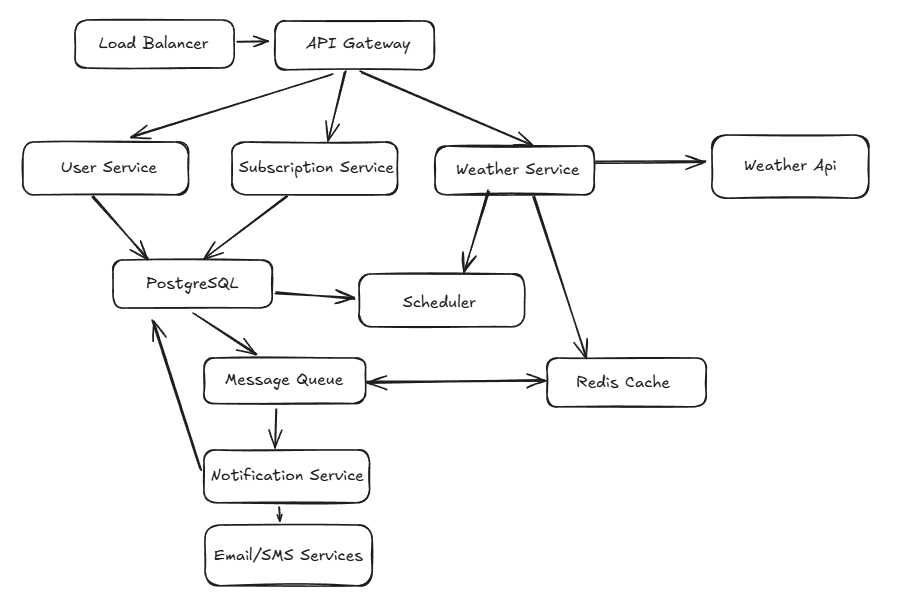

## System Design: Weather Subscription API

### 1. Вимоги системи

#### Функціональні вимоги
* Як користувач, я хочу мати можливість підписатись на оновлення погоди конкретного міста
* Як користувач, я хочу налаштовувати частоту сповіщень (щогодинно, щоденно, щотижнево)
* Як користувач, я хочу отримувати регулярні оновлення погоди залежно від обраної частоти
* Як користувач, я хочу мати змогу скасувати підписку в будь-який момент часу
* Як користувач, я хочу отримувати актуальні дані про погоду
* Як користувач, я хочу мати можливість обирати як отримувати сповіщення (email, SMS)
* Як користувач, я хочу мати можливість персоналізувати налаштування (мова, одиниці виміру, часовий пояс) 
* Як користувач, я хочу отримувати попередження про екстрені погодні умови в моєму місті негайно, 
не залежно від обраної частоти розсилки

#### Нефункціональні вимоги
* **Сумісність:** Система повинна бути сумісна з різними браузерами (Chrome, Firefox, Safari, Edge).
* **Локалізація:** Система повинна підтримувати різні мови та бути локалізованою для різних країн (UA, EN, DE, FR, ES).
* **Масштабованість:** Система повинна мати можливість адаптуватися до зростання обсягів користувачів, додаткових функцій, 
а також до збільшення завантаження на сервери та мережеві ресурси (до 100к користувачів)
* **Надійність:** Система має бути вбережена від перевантажень, не запланованих відключень, рейдів, 
тому має містити резервне зберігання даних (99.9% uptime).
* **Безпека:** Система має бути безпечною та валідувати дані (HTTPS, JWT токени, rate limiting, GDPR compliance)
* **Продуктивність**: Відповідь API < 200ms, кешування 95% запитів

#### Обмеження
* Система повинна бути спроєктована таким чином, щоб забезпечити швидку реакцію та обробку запитів при навантаженні 
до 20000 запитів на годину, з можливістю горизонтального масштабування для забезпечення високої доступності.
* Використання open-source рішень де можливо, для економії бюджету
* Використання GDPR compliance для користувацьких данних
* Підписка максимум на 10 міст від одного користувача

### 2. Оцінка навантаження

#### Користувачі та трафік

**Активні користувачі:** 50К
**Підписки на користувача**: До 10 міст 
**API запити:** 
* Щогодинні сповіщення: 15000/годину
* Щоденні сповіщення: 8000/день
* Щотижневі сповіщення: 2000/тиждень
* CRUD операції: 1000/годину

#### Дані

* **Користувач**: близько 2KB (id, email, preferences, locale, timezone)
* **Підписка:** близько 1КB (user_id, city, frequency, channels, settings)
* **Weather cache:** близько 5KB на місто
* **Загальне зберігання:** близько 500MB + індекси + логування

#### Bandwidth
* **Incoming:** 1000 запитів/год × 2KB = 2MB/год
* **Outgoing:** 75,000 notifications/день × 1KB = 75MB/день
* **3rd party API:** 1000 міст × 24 calls/день = 24K calls/день

### 3. High-Level архітектура

### 4. Детальний дизайн компонентів

#### API Gateway

**Відповідальність:**

* Маршрутизація запитів
* Rate limiting та аутентифікація
* Логування та моніторинг

#### User Service (Node.js/Nest.js)

**Відповідальність**
* Реєстрація та аутентифікація користувачів
* Управління профілями та налаштуваннями
* GDPR compliance (видалення даних)

**Endpoints**
Реєстрація: `POST /auth/register`  
Авторизація: `POST /auth/login`  
Профіль користувача: `GET /users/profile`  
Оновлення налаштувань: `PUT /users/preferences`  

#### Subscription Service (Node.js/Nest.js)

**Відповідальність**
* CRUD операції з підписками
* Валідація підписок (ліміт 10 міст)
* Управління токенами підтвердження

**Endpoints**
Підписка: `POST /subscriptions`  
Підтвердження підписки: `GET /subscriptions/{id}/confirm`  
Оновлення підписки: `PUT /subscriptions/{id}`   
Відписка: `DELETE /subscriptions/{id}`  

#### Weather Service (Node.js/Nest.js)

**Відповідальність**
* Інтеграція з зовнішніми weather API 
* Кешування погодних даних
* Детекція критичних погодних умов

**Endpoints**
Поточна погода: `GET /weather/{city}`  
Прогноз: `GET /weather/{city}/forecast`  
Критичні попередження: `POST /weather/alerts`  

#### Notification Service (Node.js/Nest.js)

**Відповідальність**
* Відправка email/SMS сповіщень
* Шаблони повідомлень
* Обробка черги повідомлень

#### Scheduler Service (Node.js/Nest.js)

**Відповідальність**
* Планування регулярних розсилок
* Моніторинг критичних погодних умов
* Cleanup старих даних

### 5. База даних

#### PostgreSQL (Основна БД)

**Таблиці:**
`users` - користувачі  
`subscriptions` - підписки  
`cities` - довідник міст  
`notification_logs` - історія сповіщень  

#### Redis (Кеш)
**Використання:**

* Кешування погодних даних (TTL: 1 година)
* Сесії користувачів
* Rate limiting лічильники

#### Message Queue (RabbitMQ)
**Відповідальність:**
* Асинхронна обробка задач
* Decoupling між сервісами
* Забезпечення надійного доставлення повідомлень